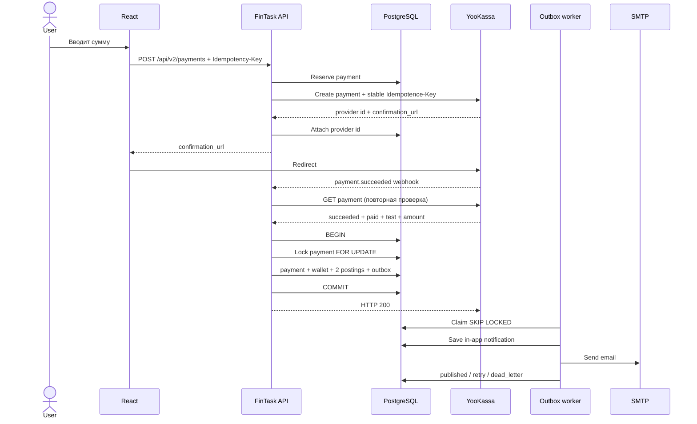

# Последовательность пополнения

```mermaid
sequenceDiagram
    actor User
    participant UI as React
    participant API as FinTask API
    participant DB as PostgreSQL
    participant YK as YooKassa
    participant Worker as Outbox worker
    participant SMTP

    User->>UI: Вводит сумму
    UI->>API: POST /api/v2/payments + Idempotency-Key
    API->>DB: Reserve payment
    API->>YK: Create payment + stable Idempotence-Key
    YK-->>API: provider id + confirmation_url
    API->>DB: Attach provider id
    API-->>UI: confirmation_url
    UI->>YK: Redirect
    YK-->>API: payment.succeeded webhook
    API->>YK: GET payment (повторная проверка)
    YK-->>API: succeeded + paid + test + amount
    API->>DB: BEGIN
    API->>DB: Lock payment FOR UPDATE
    API->>DB: payment + wallet + 2 postings + outbox
    API->>DB: COMMIT
    API-->>YK: HTTP 200
    Worker->>DB: Claim SKIP LOCKED
    Worker->>DB: Save in-app notification
    Worker->>SMTP: Send email
    Worker->>DB: published / retry / dead_letter
```

Повторный webhook блокирует ту же строку платежа и видит статус `succeeded`,
поэтому не создает вторую ledger-транзакцию.
